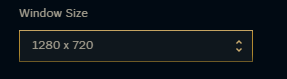

# League of Legends - Auto Champ Selector

You can run this Python script while you have League of Legends open and you've started a draft queue. It will automatically select and ban the specified champions for you.

## Requirements

- Python 3

## Instructions

1. Clone this repository.
2. In a `cmd` prompt (Windows Command Prompt, or Powershell, for example) navigate to where you cloned the repository.
3.  Run `python -m pip install -r requirements.txt`. 
4. Run `python select_champ.py --champs zyra taric lulu --bans mord mundo pyke`. The actual champs you select here are the priorities of champs to play, and ban, respectively. For example, the first priority would be to play Zyra and ban Mordekaiser.
5. Queue up for a draft game.

Note: You'll have to ensure that you don't have something like Porofessor popping up in front of your champ select lobby screen, as the script is looking for matching screenshots and will fail if another window is blocking your LoL window.

Make sure your Client Window Size is 1280x720 (in Client / General Settings):

## If It's Not Working

1. If the script is failing, it may be because your resolution / video settings differ from mine when I took the screenshots. This script uses `pyautogui` and relies on matching screenshots. Therefore, if your screen doesn't match the screenshots provided, it might not work. You could resolve this problem by taking your own screenshots and replacing the images in the `img` directory.
